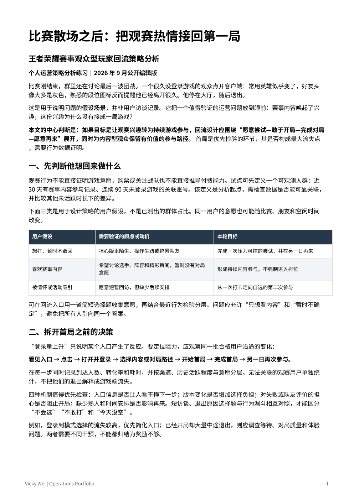

# 魏欣悦 Vicky Wei

**用户与市场洞察 · 海外社区运营 · AIGC 内容与交互设计**

我关注用户如何理解产品、参与社区，以及反馈如何转化为内容与体验的改进。这里汇集我的运营分析报告、项目案例和实践经历，展示从发现问题、组织信息到推进交付的过程。

My work connects user insights, overseas community operations, and AI-assisted content creation. This portfolio shares the questions I explored, the work I contributed, and the outputs I helped deliver.

[项目案例](projects/index.md) · [分析报告](reports/README.md) · [LinkedIn](https://www.linkedin.com/in/xinyue-wei-98178338a/) · [GitHub 主页](https://github.com/vickywei-999)

## 关于我

我的学习背景涵盖市场营销、经济学与传媒，实践涉及海外创作者社区、消费级 AI 产品、品牌内容研究和跨文化活动。我擅长从社区讨论、问卷、内容表现和产品反馈中整理问题，再将判断落实到内容策划、用户沟通、测试跟进与可复用的工作流程。

我希望持续探索行业与市场分析、海外用户与创作者运营、AIGC 内容等方向，让创意表达与真实用户需求建立更直接的联系。

## 项目与经历

下表概览每项实践的背景、本人贡献与交付。点击项目名称可阅读完整案例。

| 项目 | 背景 | 本人职责 | 成果与交付 |
| --- | --- | --- | --- |
| [万兴海外创作者运营](projects/wondershare-creator-operations.md) | 海外创作者入驻与持续内容供给 | 社区答疑、活动触达、模板交付和反馈跟进 | 参与 4 场创作活动；推进内容审核、修改与上架协作 |
| [Souler 社区与 Beta 测试](projects/souler-community-beta.md) | 消费级 AI 产品的海外内容与用户反馈 | 社媒内容、Discord 共创、测试组织与问题分类 | 内容与社区运营案例、报名流程及反馈记录 |
| [AIMON 角色内容与交互](projects/aimon-character-interaction.md) | AI 互动硬件中的角色体验 | Persona、结构化 Prompt、回应规则与动作内容 | 角色设定、交互流程和动态内容制作方法 |
| [Lamborghini 用户与竞品洞察](projects/lamborghini-user-competitor-insights.md) | 多伦多授权经销商的品牌沟通 | 汇总用户反馈，观察竞品内容与活动 | 用户需求分类、内容洞察与优化建议 |
| [南京虎虎小红书内容](projects/nanjing-huhu-xiaohongshu-content.md) | 品牌在内容平台的表达与触达 | 选题、撰写、发布、审核与复盘 | 完成 17 篇笔记及持续选题优化 |
| [北京点金石 KOL 媒介合作](projects/beijing-dianjinshi-kol-media.md) | 品牌与内容创作者的合作执行 | KOL 筛选、合作沟通、脚本和发布跟进 | 创作者适配判断、内容修改与投放复盘支持 |
| [C Valley 留学生社区](projects/c-valley-student-community.md) | 留学生的信息与文化适应需求 | 社区内容规划、账号运营和表现跟踪 | 面向目标人群的内容与发布节奏优化 |
| [阿尔伯塔大学校园活动](projects/alberta-student-events.md) | 学生组织的文化、学术与社交活动 | 流程、物资、预算、志愿者与宣传协调 | 活动执行与跨组织协作经验 |
| [Chuangmei 视觉设计](projects/chuangmei-visual-design.md) | 广告传播中的视觉表达 | 设计需求理解、视觉素材制作与调整 | 平面设计与协作交付实践 |
| [英语学习支持](projects/english-learning-support.md) | 学习者的语言理解与练习需求 | 教学准备、沟通与学习支持 | 教学表达和服务流程实践 |

## 运营分析报告

### 从看比赛到再玩一局

**一个能看懂决赛、却不愿重新开局的老玩家，需要怎样的回归路径？**

这份分析从“为什么愿意看比赛，却不愿再玩一局”出发，核对公开数据，说明目前的工作进展、玩家可能遇到的问题，以及三项改进建议。文章逐项解释点击、回访、完成游戏和再次参与的计算方法，并说明怎样比较两种做法。方案尚未实际运行，业务效果仍需验证。

| 阅读方式 | 内容 |
| --- | --- |
| [在线阅读全文](reports/hok-player-reactivation/README.md) | 适合浏览器和手机阅读的完整文章 |
| [打开 PDF 文件](reports/hok-player-reactivation/report.pdf) | 排版后的独立报告，可通过文件页下载 |
| [报告导航](reports/README.md) | 报告主题、类型与阅读入口 |

## 市场与竞品分析报告

### 兰博基尼竞品分析

**兰博基尼在超豪华跑车市场里，到底站在什么位置？**

这份本科阶段完成的市场分析把兰博基尼放在奢侈品市场中观察：先界定市场分层，再识别真正的竞争对手，然后从品牌定位、目标客群、产品特点、价格区间和销量份额五个维度做横向对比。报告用公开的 2022 财年数据说明，兰博基尼的销量规模很大程度由 SUV 车型 Urus 支撑；如果只看双座超跑，它与法拉利仍有明显差距。所有数据来源均可在文末核对。

| 阅读方式 | 内容 |
| --- | --- |
| [在线阅读全文](reports/lamborghini-competitive-analysis/README.md) | 适合浏览器和手机阅读的完整文章 |
| [打开 PDF 文件](reports/lamborghini-competitive-analysis/report.pdf) | 排版后的独立报告，可通过文件页下载 |
| [报告导航](reports/README.md) | 报告主题、类型与阅读入口 |

## 照片与报告预览

&nbsp;&nbsp;&nbsp;<a href="reports/hok-player-reactivation/README.md"></a>

[查看照片](assets/photos/portrait.jpg) · [打开完整报告](reports/hok-player-reactivation/README.md)

## 目录导航

```text
operations-portfolio/
├── README.md                       # 作品集主页
├── MAINTENANCE.md                  # 内容更新约定
├── projects/
│   ├── index.md                    # 10 个案例索引
│   └── <project-name>.md           # 背景、职责、方法与成果
├── reports/
│   ├── README.md                       # 分析报告导航
│   ├── hok-player-reactivation/         # 运营分析
│   │   ├── README.md                   # 在线阅读全文
│   │   └── report.pdf                  # 预览与下载
│   └── lamborghini-competitive-analysis/  # 市场与竞品分析
│       ├── README.md                   # 在线阅读全文
│       └── report.pdf                  # 预览与下载
└── assets/
    ├── photos/portrait.jpg         # 个人照片
    └── previews/hok-report.png     # 报告首页预览
```

本作品集由个人经历与分析作品整理。项目页面聚焦本人贡献和可展示的交付，报告中的策略建议与实施成果分别说明。涉及第三方产品和品牌的名称用于描述项目背景。
