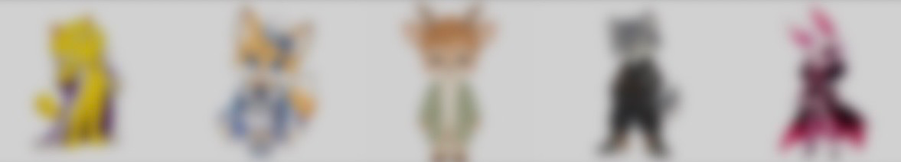

# AIGC 角色内容工作流 SOP：从 Persona 到迭代

**一份可复用的五阶段方法文档　·　来自 AIMON 互动 AI 硬件项目的实践沉淀**

**个人方法文档 · 2026 年**

## 这份 SOP 解决什么问题

AIMON 是一款以原创 AI 角色为核心的互动硬件产品。用户可以通过语音与设备中的角色交流，角色依据自身设定给出语言回应，并结合预设动画形成更完整的互动体验。

在角色内容的实际制作中，反复出现三类问题：

- **人格一致性**：同一角色在不同对话场景中要保持稳定的语气、价值取向和行为习惯，避免「人设跳脱」。
- **语言与动作匹配**：角色不仅要回答正确，语气、情绪和动作也要属于同一个角色。
- **生成稳定性**：静态角色转成动画后容易出现外形变化、服装与配饰漂移、动作失真和镜头异常，需要一套可重复的优化方法。

这份文档把解决这些问题的工作方式整理成**五个阶段的流程**。它不是项目介绍，而是一份操作说明：任何人拿到一个新角色，都可以按同样步骤建立内容，并按清单自检。

## 保密说明与适用范围

- 本文不包含公司内部的 Prompt、角色脚本、产品规则与未公开素材；文中交互示例均为**脱敏后的方法示意**，不是真实台词。
- 流程本身是通用的，可迁移到其他以角色为核心的 AI 产品，例如陪伴类应用、虚拟形象、互动玩具。

## 流程总览

| 阶段 | 输入 | 关键动作 | 输出 | 完成标准 |
| --- | --- | --- | --- | --- |
| ① Persona 设定 | 角色概念、产品定位 | 把抽象人设写成可执行规则 | Persona 文档 + 结构化 Prompt | 五要素齐全，且写明「不符合人设」的边界 |
| ② 分镜拆解 | Persona、动作需求 | 把动作拆成有时间段的目标 | 分镜表 | 每个时间段有明确动作目标，含首尾状态 |
| ③ AIGC 生成 | 分镜、角色基准图 | 按分镜生成动态素材 | 候选视频素材 | 素材可追溯：能对应到具体分镜与 Prompt 版本 |
| ④ 质量检查 | 候选素材 | 逐项检查四类常见问题 | 质检记录与归因结论 | 每个不合格素材都有归因，不是「感觉不行」 |
| ⑤ 迭代与沉淀 | 归因结论 | 固定变量做对照测试 | 稳定版本 + 可复用资产 | 稳定版本命名归档，问题进入问题库 |

完整链路可以写成一条线：

**角色基准图 → 动作概念 → 分镜拆解 → Prompt 设计 → 生成 → 质量检查 → 问题归因 → Prompt 与动作调整 → 多轮对照测试 → 稳定版本筛选 → 动作资产沉淀**

其中前五步属于「一次性设定」，后半段是每一轮都要重复的循环。实际项目中，循环往往要跑三到五轮才能得到一个稳定版本。

## 阶段一：Persona 设定

**目标。** 先定义「这个角色是谁」，再定义「它如何回应」。Persona 是整个流程的地基，地基不稳，后面每一个环节都会反复返工。

**必须写完的五个要素：**

- **视觉身份**：角色外观、服装、颜色、年龄感与整体气质。
- **人物设定**：姓名、背景、核心性格、与用户的关系。
- **语言风格**：句子长度、语气、常用表达、情绪强度。
- **行为规则**：角色在陪伴、提醒、鼓励、玩笑等场景中的典型反应。
- **边界约束**：明确哪些表达与行为**不符合**人设。这一条最容易被忽略，但它决定了模型会不会「自由发挥」导致角色失真。

**交付物与检查点。** 每个要素独立成段，语言风格部分要给出正例与反例句子。检查标准是：只读文档、不看角色图，也能判断一句台词是否「像这个角色说的」。

## 阶段二：分镜拆解

**目标。** 把一句笼统的动作需求，拆成有明确时间段和动作目标的分镜。

**动作体系先分类。** 一个角色的动作可以先归为四类，避免遗漏：

| 类型 | 内容 | 作用 |
| --- | --- | --- |
| Idle | 待机、眨眼、轻微身体动作 | 让角色「活着」，是其他动作的回到点 |
| Dialogue | 点头、思考、回应等通用对话动作 | 支撑日常交流 |
| Emotion | 开心、疑惑、惊讶、害羞等情绪动作 | 表达情绪状态 |
| Special | 符合角色个性的标志性动作与彩蛋 | 形成角色记忆点 |

**分镜的关键规则。** 一是每段动作要写清楚「第几秒做什么」，而不是只写「做一个开心的动作」；二是要在设计阶段就约束**首尾状态**，让动画结束能自然回到 Idle，否则后期会发现循环衔接不上，只能返工重做。

**交付物与检查点。** 一张分镜表，包含时间段、动作目标、镜头、首尾状态四列。检查标准是：把分镜表交给另一个人，他能复述出这段动画大致长什么样。

## 阶段三：AIGC 生成

**目标。** 按分镜生成候选素材，并且让每个素材都可追溯。

**执行步骤。**

- 准备角色基准图：以基准图作为一致性的锚点，后面每轮生成都对照它。
- 从动作概念出发，按分镜逐段生成，不要把多个动作混在一条提示里。
- Prompt 建议覆盖五项：角色约束、动作幅度、镜头、时长、首尾状态。
- **小批量生成**：同一分镜一次生成少量候选，而不是一次生成大量再挑，这样问题更容易定位。
- 命名与版本管理：素材文件名带上「角色 + 动作 + 分镜号 + 轮次」，否则多轮之后无法追溯哪一版对应哪个 Prompt。

**交付物与检查点。** 一组可对应到分镜的候选素材。检查标准是：随便挑一个文件，都能说出它来自哪个分镜、哪一版 Prompt。

## 阶段四：质量检查

**目标。** 把「看起来不对」变成「知道哪里不对」。质检不是凭感觉筛掉素材，而是给出可复用的归因。

| 检查项 | 典型问题 | 常见归因 | 处理方式 |
| --- | --- | --- | --- |
| 角色一致性 | 脸部、发型或比例在动作中变化 | 角色约束不足，或动作幅度超出设定范围 | 强化角色约束、控制动作幅度、多轮生成筛选 |
| 服装与配饰变形 | 复杂细节在运动中漂移或变形 | 高风险细节过多 | 减少高风险细节、调整动作幅度、重新生成验证 |
| 动作稳定性 | 出现多余动作、节奏混乱、表现不自然 | 分镜不够清晰，动作目标不明确 | 把复杂动作拆成清晰分镜，明确各时间段目标 |
| 循环衔接 | 动画结束无法自然回到待机 | 设计阶段没有约束首尾状态 | 在设计阶段提前约束首尾，使动作更易与 Idle 衔接 |

**交付物与检查点。** 一份质检记录，每个不合格素材都要写下归因。检查标准是：**归因要能指向下一步的具体动作**。如果归因写成「这版不太好」，这一轮质检就没有产生价值。

## 阶段五：迭代与沉淀

**目标。** 用最小的改动解决问题，并把这一轮的经验变成下一轮的基础。

**对照测试方法。** 固定其他变量，只改一个因素（例如只调整动作幅度，或只强化角色约束），生成后与上一版并排比较。这样才能判断到底是哪个因素产生了影响。如果一次改了三四个地方，即使结果变好，也无法复用经验。

**版本筛选。** 每轮结束后标记稳定版本，记录它对应的分镜号与 Prompt 版本，避免后续误用中间版本。

**资产沉淀。** 把可复用的部分留下来：分镜模板、Prompt 片段、问题与处理方式的问题库、角色的稳定基准图。下一轮或下一个角色可以直接从这些资产开始，而不是从零重做。

**交付物与检查点。** 稳定版本清单 + 问题库。检查标准是：下一个新角色启动时，有多少工作可以直接复用。

## 端到端工作流

把角色内容放到产品里看，完整链路是：

**用户场景 → 角色定位 → Persona → Prompt 规则 → 交互逻辑 → 动作设计 → AIGC 生成 → 质量测试 → 设备导入 → Voice + Animation → 实际交互 → 持续迭代**

其中「实际交互 → 持续迭代」这一环说明：SOP 不是一次性交付，设备端的真实使用反馈会重新回到 Persona 与分镜阶段，成为下一轮修正的输入。

## 角色示例（脱敏）

我负责五个新增角色的角色定义、结构化 Prompt 与对话逻辑、动作策划、AIGC 视频生成及设备端内容适配。下图是五个角色的形象示意，**内部未公开角色已做虚化处理**。

**脱敏交互示例。** 用户输入「今天有点累」，流程按以下方式运转：

| 环节 | 结果 |
| --- | --- |
| 场景识别 | 疲惫 / 情绪支持 |
| 回应策略 | 温和、简短、不说教 |
| 动作触发 | 关心动作 → 回到待机 |
| 最终体验 | Voice + Animation |

设计原则是：用户不会总是直接表达「我需要什么」。先识别场景与情绪，再让不同角色按照各自的 Persona 生成回应；同一个输入在不同角色上可以产生不同的语言和动作，但人物性格保持一致。

## 职责边界

这个项目里我负责的是**角色内容与交互设计**：角色定义、结构化 Prompt、对话逻辑、动作策划、AIGC 视频生成与设备端内容适配。我**不涉及**硬件研发、后端开发或模型训练。文中所有交互示例均经过脱敏，不代表实际产品台词。

## 复用检查清单

换一个新角色开工前，可以按这份清单快速自检：

- Persona 五要素是否写齐，并且写明「不符合人设」的边界？
- 分镜表是否包含时间段、动作目标、镜头与首尾状态？
- Prompt 是否覆盖角色约束、动作幅度、镜头、时长、首尾状态？
- 素材命名是否能追溯到分镜号与 Prompt 版本？
- 质检是否给出归因，且归因能指向下一步动作？
- 对照测试是否只改了一个变量？
- 稳定版本是否已命名归档，问题是否已进入问题库？

[返回报告导航](README.md)
